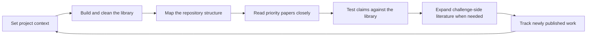

# StarMap Primary Guide for Research Leads and New Contributors

Review baseline: `2026-05-10`

## Positioning

This document presents StarMap as a thesis-centered research system organized around its interface and major workspaces.

It is written for:

- project leads
- product owners
- new contributors
- readers who need a system-level understanding before they need implementation detail

This is the primary guide, not the implementation appendix. It intentionally does not focus on:

- low-value CRUD explanation
- function-by-function code walkthroughs
- parameter ledgers, tuning notes, or audit-oriented weight breakdowns

Those materials belong in the companion document:

- [StarMap Companion Reference for Implementers and Auditors](./StarMap_Companion_Reference_for_Implementers_and_Auditors.md)

The purpose of this guide is to explain how StarMap is structured, how users move through it, and how each major workspace supports one stage of the research loop.

## How to Read This Guide

StarMap is easier to understand from the outside in than from the architecture inward. For that reason, this guide follows the user's actual path through the product:

- first, the common interface layer and foundational functions
- then, the five major workspaces that carry the deeper research work

The document should therefore be read less as a feature inventory and more as a map of how StarMap organizes a research project over time.

## StarMap at a Glance

StarMap is best understood as a workbench for one live research direction. A project is expected to correspond to one thesis topic, chapter argument, or tightly scoped research question. The system then helps the user build a library, understand its structure, read core papers closely, test claims against evidence, explore challenge-side literature, and keep the project current as new work appears.

At the highest level, the research loop looks like this:

The six sections below explain where each part of that loop lives in the current interface.

## Table of Contents

1. [Interface Layer and Foundational Functions](#1-interface-layer-and-foundational-functions)
2. [Workspace Atlas](#2-workspace-atlas)
3. [Read A Paper](#3-read-a-paper)
4. [Evidence Board](#4-evidence-board)
5. [Challenge Stardust](#5-challenge-stardust)
6. [Project Literature Watch](#6-project-literature-watch)

---

## 1. Interface Layer and Foundational Functions

### 1.1 Why this section comes first

Before a user enters any deep workspace, they encounter a common project shell. That shell defines project identity, displays integration readiness, exposes shared actions, and manages the paper pool used across the entire system.

This layer matters because it is not merely decorative. It sets the project's semantic baseline, establishes whether the environment is operational, and exposes the functions that make the five major workspaces usable.

### 1.2 What the user sees at the interface layer

At the top level of a project, the user typically encounters:

- the project title and project-level navigation
- access to `Settings`
- a return path to `Dashboard`
- integration health indicators for the LLM, Zotero, and OpenAlex / Scholar API
- lightweight action surfaces for library management and workspace entry

This is the system's orientation layer. It tells the user whether the project is ready, where they are, and what the most immediate next actions are.

For a new user or new contributor, it also answers a practical onboarding question: "Is this project ready for serious work yet?" If integrations are unavailable, if the repository is still thin, or if the project context is underspecified, the rest of the system will feel weaker than intended. The interface layer makes that readiness visible.

### 1.3 Foundational functions exposed from the interface layer

The current project shell exposes a small set of shared functions that matter across the whole system:

| Interface block | Main role in the workflow |
| --- | --- |
| `Paper Status Overview` | Gives a quick reading-state view across the imported library |
| `Import PDFs` | Adds local papers and supports rollback of the latest batch |
| `Auto Cluster Themes` | Opens the clustering entry point without forcing the user into a graph first |
| `Sync Zotero` | Connects the project to the external Zotero library |
| `All Papers` | Opens the project-wide paper hub for search, filtering, and cross-cutting inspection |
| `Settings` | Controls shared runtime and project-level behavior |

These functions are foundational because they do not belong to only one analytical workspace. They maintain the shared substrate of the project. A user may spend most of their time in one deep workspace, but these top-level functions keep the project healthy enough for all workspaces to remain useful.

### 1.4 The project as the shared semantic baseline

Every major workspace depends on one central project object. At minimum, that object carries:

- `Target Title`
- `Target Abstract`
- `Target Current Content`

Together, these fields define the thesis context that shapes:

- similarity ranking
- cluster naming and interpretation
- claim analysis and evidence grouping
- literature-watch relevance
- explanation quality across the interface

For that reason, the interface layer should be understood not only as navigation, but also as a project-level semantic control surface. In many research tools, the top layer is operational but not intellectually important. In StarMap, the opposite is true: the project shell quietly determines the baseline that makes ranking, clustering, and argument support coherent everywhere else.

### 1.5 Import, curation, and paper-pool preparation

Before any deep research analysis can happen, the system needs a usable paper pool. The interface layer is where that preparation begins.

Its foundational responsibilities include:

- importing local PDFs
- merging newly imported papers into the project
- rolling back the latest local import batch when intake quality is poor
- syncing with Zotero to fetch or push literature assets
- exposing a project-wide `All Papers` view for manual cleaning and review

This stage matters because StarMap assumes that analysis quality depends heavily on the quality of the shared library feeding every workspace downstream. A weak import pass, poor metadata, or an incoherent initial paper pool will not stay local to the import step; those weaknesses propagate into structure analysis, evidence classification, and watch relevance later on.

### 1.6 Shared states across all workspaces

Although StarMap is divided into distinct workspaces, several project-level states persist across them:

- reading statuses such as `Core`, `Pending`, `Unread`, and `Underweight`
- paper notes and curation decisions
- clustering readiness and project-level cluster caches
- integration readiness
- project preferences such as background precompute, theme naming behavior, density choices, and watch settings

This continuity is one of StarMap's main design strengths. A user's judgment about a paper in one place can affect how that paper behaves everywhere else, which is exactly what a thesis-centered research environment should do.

### 1.7 What this section should establish

After reading this section, the reader should understand:

- how a user first enters and orients inside a project
- which actions are common infrastructure rather than workspace-specific analysis
- why project context and library preparation sit upstream of everything else

The interface layer is not merely a landing page. It is the project's operational and semantic staging area.

---

## 2. Workspace Atlas

### 2.1 Role of Workspace Atlas in the system

`Workspace Atlas` is the main structural analysis workspace in StarMap. Its role is to help the user see the repository as a shaped research landscape rather than as a flat paper list.

If the interface layer prepares the project and the paper pool, Workspace Atlas turns that pool into a spatial and relational map that supports orientation, discovery, and structure judgment. It is often the first place where the user feels that StarMap is more than a ranked queue, because it reveals not just which papers are relevant, but how the repository behaves as a structured body of literature.

### 2.2 Core question this workspace answers

Workspace Atlas is designed to answer a family of related questions:

- Which papers sit closest to the project's main thesis direction?
- Which papers cluster together conceptually or topologically?
- Which papers act as bridges, anchors, or structurally important nodes?
- How does the current library look when seen as a map rather than a queue?

These are the questions that arise once the library has grown beyond the point where linear reading order is enough. Atlas exists because repository understanding eventually becomes a structural problem, not just a sorting problem.

### 2.3 Main views inside Workspace Atlas

The current Atlas workspace brings together multiple views of the same repository:

| View | What it helps the user see |
| --- | --- |
| `Orbital` | Broad relevance distribution around the target thesis |
| `Network` | Neighborhood structure, bridge papers, and local proximity |
| `Citation Graph` | Directed citation relationships and graph backbone |

These are not redundant charts. They are different interpretive lenses over the same library. The practical value of the design is that users can shift between "What is near my target?" and "What is connected to what?" without leaving the same conceptual workspace. That lowers the cost of moving between topical thinking and structural thinking.

### 2.4 Atlas as the home of clustering and navigation

Atlas is also where StarMap's clustering story becomes visible and actionable. In practical use, this workspace supports:

- `Semantic Cluster` as a topic-grouping lens
- `Citation Cluster` as a community and lineage lens
- local node exploration
- marked-node workflows
- saved exploration traces such as manual paths and custom citation structures

This makes Workspace Atlas both a visualization surface and a navigation surface. That dual role matters. The workspace is not only for interpretation after the fact; it changes what the user does next. A bridge paper found here may become the next reading target. A dense citation community may become the next cluster to inspect. A surprising isolated node may trigger a library-cleaning decision.

### 2.5 Typical user flow in this workspace

A common path through Workspace Atlas looks like this:

1. Open the project and inspect the current library shape.
2. Adjust visualization density to match the desired trade-off between coverage and performance.
3. Switch among orbital, network, and citation views.
4. Identify promising clusters, bridge papers, or anchor papers.
5. Open individual papers or jump into deeper reading and evidence work from structurally important nodes.

The workspace therefore acts as a bridge between broad repository orientation and more focused downstream analysis. It is best treated as the system's structural hub rather than as an optional visual add-on.

### 2.6 When this workspace is especially valuable

Workspace Atlas becomes especially valuable when:

- the project already contains enough papers that simple ranking is no longer sufficient
- the user wants to understand subfields or thematic pockets inside the repository
- the user suspects that one or two bridge papers are linking otherwise separate conversations
- the project is moving from repository growth into repository interpretation

### 2.7 What this workspace contributes to the larger research loop

In the full StarMap loop, Workspace Atlas contributes:

- structural orientation
- cluster-level understanding
- citation-topology awareness
- transition points into deeper reading, evidence work, and counter-evidence expansion

It is the system's main answer to the question: "What kind of library have I actually built?"

---

## 3. Read A Paper

### 3.1 Role of Read A Paper in the system

`Read A Paper` is StarMap's deep-reading workspace. It exists for the point at which repository-level orientation is no longer enough and the user needs close engagement with a priority paper.

This workspace prevents StarMap from becoming overly abstract. High-level repository intelligence is useful only if the user can eventually return to the primary source text and interrogate it carefully. Read A Paper provides that return path.

### 3.2 Core question this workspace answers

This workspace is designed to answer:

- What is this paper actually saying?
- Which parts of it matter to my project?
- Where are the strongest passages, weaknesses, limitations, or useful methods?
- How do I turn this reading into reusable project knowledge?

### 3.3 Main capabilities of Read A Paper

The current reading workspace is not a generic PDF viewer. It is built around critical reading and grounded extraction. Its capabilities include:

- opening and reading a selected PDF in context
- asking user-driven questions about the paper
- surfacing evidence-like passages
- recording highlights, marks, and reading notes
- identifying strengths, weaknesses, limitations, or useful methods
- exporting reading results back into Zotero when needed

The design intent is to convert deep reading from a private one-off act into a reusable project asset. The goal is not just comprehension in the moment. The goal is to produce portable insight that can later support claim work, note reuse, Zotero export, or broader repository judgment.

### 3.4 Relationship to the rest of the system

Read A Paper is tightly connected to other parts of StarMap:

- it usually begins from a paper selected in Atlas or the paper library
- it can strengthen understanding of a paper already suspected to be `Core`
- it can generate material that later informs claim analysis
- it can export enriched reading outputs back to Zotero

It should therefore not be interpreted as a detached reader module. Its best use is relational: a user arrives because some earlier workspace made the paper matter, and leaves with material that strengthens later project reasoning.

### 3.5 Typical user flow in this workspace

1. Select a priority paper from the library, map, or cluster context.
2. Open the PDF and inspect the paper in detail.
3. Ask a focused question or review it through a critical-reading lens.
4. Mark passages, record notes, and extract grounded observations.
5. Preserve or export the resulting reading artifact for later project use.

A strong session in this workspace usually produces one of three outcomes:

- stronger understanding of a genuinely central paper
- grounded caution about a paper that looked promising at first glance
- reusable passages or notes that sharpen later argument work

### 3.6 When this workspace is especially valuable

Read A Paper is especially valuable when:

- a paper has already been marked or suspected to be `Core`
- a cluster or graph view has surfaced a structurally important but not yet fully understood paper
- a claim analysis result is intriguing but still too coarse
- the user needs grounded passages rather than high-level summaries

### 3.7 What this workspace contributes to the larger research loop

Read A Paper contributes the close-reading layer that a map or ranking system cannot replace. It is where broad repository judgment is converted into detailed textual understanding.

In other words, this workspace answers: "Now that I know this paper matters, what does it actually give me?"

---

## 4. Evidence Board

### 4.1 Role of Evidence Board in the system

`Evidence Board` is StarMap's argument-organization workspace. It transforms a project from a literature collection into a structured claim-evaluation environment.

This is the point where the system becomes explicitly thesis-driven rather than merely discovery-driven. For many projects, it is also the point where the repository starts functioning like an argument rather than a collection of potentially relevant references.

### 4.2 Core question this workspace answers

Evidence Board exists to answer:

- Which papers support my claim?
- Which papers challenge or narrow it?
- Which papers mainly contribute setup, method, or background value?
- Which candidates remain ambiguous and need further judgment?

### 4.3 Main model used by the workspace

The workspace is organized around project claims and four evidence columns:

- `support`
- `challenge`
- `setup`
- `pending`

This framing matters because it converts a research library into a live argument surface. The user is no longer managing papers only by relevance, but by argumentative function. A highly relevant paper is not automatically a support paper. It may be a challenge paper, a setup paper, or only a tentative candidate. Evidence Board keeps those distinctions visible.

### 4.4 Main activities supported here

Inside this workspace, the user can:

- create and revise claims
- analyze the current library against a chosen claim
- inspect why papers were grouped into different evidence roles
- move from a claim to its supporting, challenging, or setup literature
- identify where evidence remains weak or inconclusive

The workspace therefore supports not just literature review, but argument construction and argument stress-testing. It is especially useful in thesis-writing or chapter-writing contexts, where the user is not only trying to know the field better, but trying to understand whether the current field knowledge can actually carry a specific claim.

### 4.5 Relationship to reading and structure work

Evidence Board depends on upstream work and also feeds downstream work:

- it depends on project context, curated papers, and often prior close reading
- it can send the user back to deep reading when evidence is uncertain
- it can send the user forward into Challenge Stardust when challenge-side expansion is needed

This makes Evidence Board the system's main bridge between literature organization and actual thesis reasoning. It is also where ambiguity becomes productive: weak support, mixed evidence, or too many `pending` items are not merely deficiencies, but signals about what the project still needs.

### 4.6 When this workspace is especially valuable

Evidence Board becomes especially valuable when:

- the user already has a curated library but not yet a clear argument structure
- multiple plausible papers seem relevant but their argumentative roles differ
- the user needs to know whether the repository is ready to support writing
- the project is moving from exploration into evaluation

### 4.7 What this workspace contributes to the larger research loop

Evidence Board contributes argumentative clarity. It helps the user see whether the current repository:

- genuinely supports the thesis
- hides unresolved challenges
- leans too heavily on background or method papers
- still needs targeted expansion before writing can proceed confidently

It answers: "How does my current library function as evidence?"

---

## 5. Challenge Stardust

### 5.1 Role of Challenge Stardust in the system

`Challenge Stardust` is StarMap's counter-evidence exploration workspace. It is designed for the moment when a user identifies a challenge paper or a vulnerable claim and wants to explore outward without immediately polluting the main project library.

This is one of the system's most distinctive workspaces because it treats counter-evidence discovery as a managed research activity rather than as an ad hoc search. That distinction matters in serious research work, where counter-evidence often enters a project in a messy and disruptive way. Challenge Stardust gives the user a dedicated place to explore that disruption without collapsing the organization of the main repository.

### 5.2 Core question this workspace answers

Challenge Stardust exists to answer:

- If this claim is challenged, where should I search next?
- What neighboring literature might extend or sharpen the challenge?
- Which challenge-side candidates deserve inspection before entering the main project?

### 5.3 Why it is separate from Evidence Board

Evidence Board classifies the current project library. Challenge Stardust goes beyond that boundary.

The separation is useful because it allows:

- exploratory challenge-side discovery in an isolated space
- temporary candidate pools that do not automatically change the main repository
- independent graph building around a challenge direction
- selective import back into the main project only after review

This keeps the main library cleaner while still supporting ambitious counter-evidence work. It also preserves a healthy research discipline: not every challenge-side lead deserves immediate promotion into the primary corpus. Some leads should remain exploratory until they have earned a place.

### 5.4 Main activities supported here

Inside this workspace, the user can:

- create a Stardust trail from a challenge paper or challenge-oriented seed
- inspect generated candidate papers
- review why those candidates were surfaced
- build and inspect a challenge-side graph
- decide which items should remain isolated and which should be imported into the main repository

The workspace is therefore both a discovery surface and a quarantine surface. That combination is exactly what makes it useful: it permits aggressive exploration while still preserving repository coherence.

### 5.5 Typical user flow in this workspace

1. Start from a claim or challenge paper that raises a real tension.
2. Generate a challenge-oriented exploration trail.
3. Inspect the candidate pool and local graph.
4. Manually review which candidates are truly relevant.
5. Import only the strongest additions into the main project if warranted.

A well-used Stardust trail typically ends in one of two ways:

- it identifies genuinely important challenge-side literature and enriches the main project
- it demonstrates that the apparent challenge line was weaker, narrower, or less relevant than expected

Both outcomes are valuable.

### 5.6 When this workspace is especially valuable

Challenge Stardust is especially valuable when:

- a claim appears too clean and needs deliberate pressure-testing
- the user has found one challenge paper but does not yet understand the surrounding literature
- challenge-side exploration would be useful, but direct import into the main library would be premature
- the project is entering a stage where robustness matters more than raw expansion

### 5.7 What this workspace contributes to the larger research loop

Challenge Stardust contributes disciplined counter-evidence expansion. It is StarMap's answer to the problem that good research is not only about gathering supporting papers, but also about testing the durability of the thesis under challenge.

It answers: "How do I systematically explore the literature that could weaken or refine my current argument?"

---

## 6. Project Literature Watch

### 6.1 Role of Project Literature Watch in the system

`Project Literature Watch` is StarMap's incremental frontier-tracking workspace. Its job is to keep the project alive after the initial repository has already been built.

This workspace matters because a thesis-centered literature environment cannot remain static. Once a project has a working structure, the next problem becomes controlled expansion. Project Literature Watch is the workspace that prevents a good repository from slowly becoming an outdated one.

### 6.2 Core question this workspace answers

This workspace is designed to answer:

- What new literature has appeared that is worth adding to this project?
- Which recent papers align with the target thesis?
- What have watched scholars or journals produced recently that may matter here?

### 6.3 Main watch modes

The current workspace supports three major monitoring modes:

| Mode | Main use |
| --- | --- |
| `Target Watch` | Scan for new literature around the thesis direction itself |
| `Scholar Watch` | Track recent work from watched authors |
| `Journal Watch` | Track recent work from watched journals |

These modes allow the user to keep one project current from multiple angles without leaving the StarMap workflow. Each reflects a different way research projects actually evolve. Sometimes the thesis direction itself should drive monitoring. Sometimes a few scholars matter disproportionately. Sometimes journals act as the best proxy for the frontier.

### 6.4 Why this workspace is more than a search page

Project Literature Watch is not just a place to run isolated queries. It is guided by the existing project and draws on:

- project target fields
- the current curated library
- discipline scope
- watched scholars
- watched journals and their relative importance

In that sense, this workspace acts as a continuation of project curation rather than as an independent literature search engine. The user is not starting from zero each time; the system is reusing the project's existing knowledge and priorities.

### 6.5 Main activities supported here

Within this workspace, the user can:

- run project-centered watch scans
- adjust discipline and time-window scope
- maintain scholar and journal watch lists
- assign stronger or weaker lift to watched journals
- review returned candidates before deciding whether to admit them into the project

This preserves the principle that new literature should enter through judgment, not automatically. The workspace therefore supports expansion without surrendering selectivity, which is one of the hardest balances for research tools to maintain.

### 6.6 When this workspace is especially valuable

Project Literature Watch is especially valuable when:

- the initial repository is already strong and the next need is maintenance
- the user wants to avoid repeating broad manual searches
- one or two scholars or journals have become strategically important for the project
- the project is long-running enough that freshness is now a research risk

### 6.7 What this workspace contributes to the larger research loop

Project Literature Watch contributes controlled project growth. It helps the user sustain the repository after initial setup while still keeping the project tightly tied to its original thesis direction.

It answers: "How do I keep this research project current without losing focus?"

---

## Closing Note

When organized around its interface and major workspaces, StarMap becomes easier to explain as a coherent research environment:

- the interface layer establishes the project and keeps its shared state healthy
- `Workspace Atlas` reveals the structure of the repository
- `Read A Paper` grounds that structure in close textual understanding
- `Evidence Board` turns the repository into an argument surface
- `Challenge Stardust` expands the counter-evidence frontier in a controlled way
- `Project Literature Watch` keeps the project current after the initial structure is already in place

This six-part structure is a strong fit for the primary guide because it follows the user's real movement through the product. Read together, the six sections present StarMap as one continuous environment rather than a scattered capability list.
