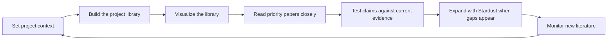

# StarMap Primary Guide for Research Leads and New Contributors

Review baseline: `2026-05-22`

## Positioning

This document explains StarMap as a user-facing research system organized around one live project and its main workspaces.

It is written for:

- research leads
- product owners
- new contributors
- collaborators who need a reliable mental model before they need implementation detail

This is the primary guide, not the technical appendix. It intentionally avoids:

- code-level walkthroughs
- parameter ledgers
- audit-style scoring breakdowns
- low-value CRUD explanation

For implementation detail, see:

- [StarMap Functional Detail Guide](./StarMap_Functional_Detail_Guide.md)

The goal of this guide is simpler: explain what StarMap is for, how a user moves through it, and how the major workspaces fit together as one research loop.

## What StarMap Is

StarMap is a thesis-centered research environment. One project should usually correspond to one thesis direction, chapter argument, or tightly scoped research question.

Within that project, StarMap helps the user:

- build and clean a paper library
- understand which papers matter most to the project
- inspect the library as a structure rather than a flat list
- read important papers closely
- test claims against the current library
- expand outward when support or challenge literature is still missing
- keep the project current as new work appears

The system is strongest when it is treated as a project workbench, not as a generic paper manager.

## The Research Loop

At a high level, StarMap supports the following loop:

```mermaid
flowchart LR
    A["Set project context"] --> B["Build the project library"]
    B --> C["Visualize the library"]
    C --> D["Read priority papers closely"]
    D --> E["Test claims against current evidence"]
    E --> F["Expand with Stardust when gaps appear"]
    F --> G["Monitor new literature"]
    G --> A
```

The rest of this guide follows that user path.

## Table of Contents

1. [Project Shell and Shared Concepts](#1-project-shell-and-shared-concepts)
2. [Building and Maintaining the Project Library](#2-building-and-maintaining-the-project-library)
3. [StarMap Visualization](#3-starmap-visualization)
4. [Read A Paper PDF](#4-read-a-paper-pdf)
5. [Evidence Board and Stardust](#5-evidence-board-and-stardust)
6. [Project Literature Watch](#6-project-literature-watch)
7. [A Practical Starting Workflow](#7-a-practical-starting-workflow)

---

## 1. Project Shell and Shared Concepts

### 1.1 Why the project shell matters

Before users enter any deep workspace, they enter a shared project shell. That layer is not just navigation. It establishes the research context that the rest of the system reuses.

In practice, the project shell answers three questions:

- What project am I working on?
- Is the environment ready for serious work?
- What should I do next?

### 1.2 The project as the semantic center

Every major workspace depends on the same project context, especially:

- `Target Title`
- `Target Abstract`
- `Target Current Content`

Together, these fields act as the semantic center of the project. They influence:

- paper relevance ranking
- visualization behavior
- claim analysis
- literature-watch relevance
- how helpful the system's explanations feel

If these fields are vague, the entire system becomes less coherent. If they are sharp, the whole project becomes easier to interpret.

### 1.3 Shared project-level functions

At the project level, users typically encounter shared functions such as:

| Interface surface | Why it matters |
| --- | --- |
| `Import PDFs` | Bring local papers into the project library |
| `Sync Zotero` | Pull from Zotero or sync PDF text back into the project |
| `All Papers` | Search, filter, review, and clean the shared paper pool |
| `Paper Status Overview` | Maintain reading-state awareness across the project |
| `Settings` | Control project behavior and integration setup |

These are shared infrastructure, not isolated features. They keep the common paper pool healthy enough for the rest of StarMap to work well.

### 1.4 Shared paper states across the system

StarMap is divided into separate workspaces, but the project behaves like one connected environment. Papers can carry shared states such as:

- `Core`
- `Pending`
- `Unread`
- `Underweight`
- notes
- reading annotations
- cluster membership
- evidence roles

That continuity is one of StarMap's core strengths. A paper is not supposed to mean one thing in one workspace and something unrelated in another. The system is designed so that library curation, reading, evidence work, and watch decisions reinforce one another.

### 1.5 What a new user should understand first

Before learning individual modules, a new user should understand this principle:

StarMap is not mainly about storing papers. It is about organizing one research direction around a living, reusable paper library.

Once that is clear, the individual workspaces make much more sense.

---

## 2. Building and Maintaining the Project Library

### 2.1 Why the library comes first

Every major StarMap workflow depends on the quality of the project library. Weak imports, poor metadata, or incomplete text content do not stay local to the import step. They affect visualization quality, claim analysis, reading support, and watch relevance later on.

For that reason, library-building is not a trivial setup task. It is the foundation of the project.

### 2.2 The five main ways papers enter the library

StarMap supports several distinct paper-intake paths. They all end in the same project library, but they begin from different starting points.

| Intake path | Best used when |
| --- | --- |
| `Import PDFs` | You already have local PDFs and want to build the library from full documents |
| `Fetch from Zotero` | You want to pull papers from an existing Zotero library or collection |
| `Sync PDF Content for Improving Similarity Calculations` | The paper already exists in the project, but you want richer PDF text to improve project matching |
| Single-paper external import | You find one promising paper from citations, search results, or external metadata and want to add it quickly |
| `Literature Watch` import | You want to admit selected results returned by the watch module |

### 2.3 `Import PDFs`

`Import PDFs` is the most direct intake path. The user selects one or more local PDFs from the project workspace.

From the user's point of view, the important behavior is:

- StarMap reads the PDF content rather than relying only on a filename
- it extracts useful paper information from the document
- it tries to enrich the paper with outside metadata when available
- it checks whether the paper already exists in the project
- it either creates a new project record or updates an existing one
- it recalculates project relevance after the merge

This path is especially useful at the beginning of a project, when the user already has a seed library on disk.

### 2.4 `Fetch from Zotero`

This path begins from the user's Zotero library or a selected Zotero collection rather than from local PDFs.

It is best when:

- the user already curates literature in Zotero
- a team wants to reuse an established bibliography
- the project library should be built quickly from an existing collection

From the user's perspective, the key idea is simple: Zotero becomes a source for project papers, but StarMap still decides how those papers fit into the project library after deduplication and merge.

### 2.5 `Sync PDF Content for Improving Similarity Calculations`

This mode matters because sometimes a paper is already in the project library, but the project still lacks enough full-text content to judge it well.

This sync path is not mainly for adding new papers. It is for improving the text completeness of papers that already exist in the project.

That distinction is important. A user should think of this feature as:

- enrich existing papers with fuller PDF text
- improve later similarity and relevance behavior
- strengthen downstream analysis without rebuilding the library from scratch

### 2.6 Single-paper external import

Sometimes the user is reading a citation chain, browsing related work, or checking an outside search result and finds one paper that deserves quick admission into the project.

In that case, StarMap can import a single candidate from external metadata. This path is useful because it lets the user expand the library opportunistically without running a large batch job.

### 2.7 `Literature Watch` import

When papers come from `Project Literature Watch`, they still do not enter the project automatically. The user reviews the watch results first, then selectively imports the strongest candidates.

This is a good design choice. It keeps the project library deliberate instead of letting it grow automatically with every monitored result.

### 2.8 What users should expect from all intake paths

Although the entry points differ, the user-facing outcome is consistent:

- StarMap tries to identify the paper
- it checks whether the paper already exists
- it merges, updates, or creates the record as needed
- it places the paper into the shared project context
- it refreshes project relevance so the rest of the system can use the paper properly

In other words, the library is one shared destination even when the intake routes differ.

---

## 3. StarMap Visualization

### 3.1 What this workspace is for

`StarMap Visualization` is the main workspace for understanding the project library as a structure rather than as a list.

It helps answer questions like:

- Which papers are closest to the project's main direction?
- Which papers belong to the same local neighborhood?
- Which papers act as bridges?
- What does the library look like as a citation structure?

This workspace is often the moment when users stop thinking of the project as "a folder of papers" and start seeing it as "a shaped literature landscape."

### 3.2 The three visualization modes

The visualization module provides three distinct modes:

| Mode | Main question it answers |
| --- | --- |
| `Orbital (Uni-directional)` | Which papers are closest to the project thesis? |
| `Network (Bi-directional)` | How do the most relevant papers relate to one another in content space? |
| `Citation Graph` | How are project papers connected by real citation relationships? |

These modes are complementary. They reuse the same library, but they answer different kinds of research questions.

### 3.3 `Orbital (Uni-directional)`

`Orbital` is the clearest mode for answering a very practical question:

Which papers should I probably care about first?

In this mode:

- the project thesis sits at the center
- papers closer to the center are more aligned with the project direction
- papers farther out are weaker fits
- `Visualization Density` controls how many papers enter the current view

This mode is especially good for early prioritization and for quick orientation after a fresh import batch.

### 3.4 `Network (Bi-directional)`

`Network` shifts attention from thesis-to-paper distance toward paper-to-paper proximity.

It helps the user see:

- local neighborhoods
- small thematic groups
- bridge papers between groups
- which relevant papers are near one another conceptually

This is the best mode when the user wants to understand the internal shape of the most relevant part of the library rather than just its ranking relative to the thesis.

### 3.5 `Citation Graph`

`Citation Graph` is different from the first two modes because it is based on real citation links rather than content similarity.

This mode helps the user see:

- lineage
- influence
- internal project citation chains
- source, bridge, and downstream papers

It is the right view when the user wants academic structure rather than semantic proximity.

### 3.6 `Visualization Density`

`Visualization Density` is not a cosmetic setting. It controls how many papers are allowed into the current view.

That matters because different moments call for different levels of breadth:

- a smaller view is easier to read
- a denser view gives more coverage
- the right setting depends on whether the user wants quick orientation or wider structure awareness

### 3.7 How users typically use this workspace

A common flow looks like this:

1. Open the visualization module after building or refreshing the library.
2. Start with `Orbital` to see which papers are nearest to the project.
3. Move to `Network` to inspect neighborhoods and bridge papers.
4. Switch to `Citation Graph` to understand lineage and internal citation structure.
5. Use what you find to choose papers for close reading, evidence work, or import review.

### 3.8 Why this workspace matters

Visualization is not just an attractive layer on top of the library. It is the system's main orientation surface.

It helps the user decide:

- where to read next
- which papers are central
- whether the project is topically coherent
- whether the library has hidden clusters or disconnected regions

That makes `StarMap Visualization` a structural hub rather than a decorative chart page.

---

## 4. Read A Paper PDF

### 4.1 What this workspace is for

`Read A Paper PDF` is StarMap's deep-reading workspace. It is designed for the point where the user no longer wants only a ranked or visual understanding of a paper, but wants to read one paper carefully and turn that reading into reusable project knowledge.

It is not just a PDF viewer. It is a reading workbench.

### 4.2 What makes it different from a normal reader

This workspace is built around one paper at a time. It supports:

- opening and parsing one PDF for focused reading
- asking paper-level questions
- asking passage-level questions
- marking and annotating specific regions
- preserving reading continuity
- exporting marked results to Zotero

Its goal is not passive reading. Its goal is to make close reading durable and reusable.

### 4.3 Choosing a PDF

The reading session begins with `Choose PDF`.

One important user-facing rule should be clear:

Uploading a PDF here does not automatically add that paper to the main project library.

This module is for deep reading of one active paper. It brings the file into the reading workspace, but it does not automatically turn that file into a project library record.

That distinction matters because this workspace is about focused reading, not project-level intake.

### 4.4 `Run Paper Critique`

`Run Paper Critique` is the paper-level analysis path. The user can optionally supply a guiding question, such as:

- What is the weakest identification assumption in this paper?
- What is the main external-validity risk?
- What should I trust here and what should I be skeptical of?

The important design principle is that the critique is not fully detached from the project. It is informed by the current project context, so the output is more useful than a generic summary.

In practical terms, the feature helps users ask:

- What does this paper mean for my project?
- Where is it strong?
- Where is it fragile?
- What should I question next?

### 4.5 `Analyze Passage`

`Analyze Passage` is the local, passage-level path.

The user selects a region on the page, then asks for analysis of that specific passage, figure explanation, method paragraph, or result statement.

This is especially useful when the user needs help with a narrow question such as:

- What exactly is this paragraph claiming?
- Does this figure actually support the authors' conclusion?
- What is the key methodological weakness in this section?

The main value of this feature is precision. It keeps the system grounded in the local evidence that the user actually selected.

### 4.6 Marking, notes, and reading continuity

The workspace also supports:

- highlights
- typed notes
- mark types such as `claim`, `evidence`, `method`, `threat`, `limitation`, `question`, and `to_cite`
- local reading continuity such as page position and current reading state

This matters because deep reading is rarely completed in one sitting. The module is designed so the user can return to the same paper and continue rather than start over.

### 4.7 Export to Zotero

When the user wants to preserve the deep-reading result outside StarMap, the marked PDF and selected notes can be exported to Zotero.

The design here is intentionally selective:

- the system exports the paper and meaningful marked reading artifacts
- it does not treat every temporary local state as something worth exporting

That keeps Zotero export focused on durable reading outcomes rather than temporary session noise.

### 4.8 Why this workspace matters

`Read A Paper PDF` is where StarMap becomes grounded in actual pages and passages.

It answers:

- What does this paper really say?
- Which parts matter for my project?
- What do I want to preserve from this reading session?

Without this workspace, the rest of StarMap would risk becoming too abstract. With it, library intelligence can be converted into usable close-reading judgment.

---

## 5. Evidence Board and Stardust

### 5.1 Why these two belong together

`Evidence Board` and `Stardust` form one continuous reasoning workflow.

They serve different roles:

- `Evidence Board` asks what the current project library already does for a claim
- `Stardust` asks where to search next when the current library is not enough

Together, they help the user move from "What evidence do I have?" to "What evidence am I still missing?"

### 5.2 `Evidence Board`: the claim-centered workspace

`Evidence Board` turns the library into an argument surface.

The user writes a claim, then asks the system to organize the current project library around that claim. The key shift is that papers are no longer judged only by topical relevance. They are judged by argumentative role.

The four main roles are:

- `support`
- `challenge`
- `setup`
- `pending`

This is one of the most important conceptual moves in StarMap. A highly relevant paper is not automatically a support paper. It may be a challenge paper, a setup paper, or a still-uncertain candidate.

### 5.3 What `Evidence Board` helps the user see

This workspace helps answer:

- Which papers directly support the claim?
- Which papers constrain, complicate, or challenge it?
- Which papers are more useful for background, setup, or method?
- Which papers may matter, but still need more reading?

That makes the board useful not just for discovery, but for writing readiness.

### 5.4 A practical way to use `Evidence Board`

A common workflow is:

1. Write a claim, chapter point, or focused research question.
2. Run `Analyze Claim`.
3. Inspect how the current project library is distributed across the four columns.
4. Open uncertain or important papers for closer reading when needed.
5. Decide whether the claim is already well supported or whether more evidence must be found.

This is often the moment when a project moves from "I have many papers" to "I know what these papers are doing for my argument."

### 5.5 Why `pending` matters

`pending` should not be read as a failure state. It usually signals one of two things:

- the claim is still not well grounded in the current library
- the relevant papers need fuller reading, better text coverage, or clearer notes

In other words, `pending` is often a useful diagnostic signal rather than a dead end.

### 5.6 Manual judgment still matters

`Evidence Board` is not meant to be a black box. Users can inspect results, pin important cards, move items, and apply their own judgment.

That is the right design for research work. The system helps organize the board, but the user remains the final judge of the argument.

### 5.7 `Stardust`: outward expansion beyond the current library

`Stardust` begins where `Evidence Board` becomes insufficient.

If the board reveals a weak challenge side, a weak support side, unclear boundary conditions, or too many uncertain papers, `Stardust` gives the user a controlled way to expand outward without automatically polluting the main project library.

This separation is important. Not every exploratory lead deserves immediate promotion into the main corpus.

### 5.8 The three main Stardust entry paths

StarMap supports three conceptually distinct ways to start a Stardust trail:

| Entry path | Best used when |
| --- | --- |
| `Challenge Stardust` | A challenge paper reveals a line of literature worth exploring outward |
| `Support Stardust` | A support paper suggests a stronger support-side neighborhood worth expanding |
| `New From Claim` | The user wants to start from a claim rather than from one existing evidence paper |

### 5.9 What Stardust returns

From the user's perspective, the important behavior is:

- Stardust looks outward from a seed or claim
- it generates a side pool of candidate papers
- those candidates stay separate from the main project library
- the user reviews them before importing anything

This makes Stardust both a discovery layer and a quarantine layer.

### 5.10 How users typically use Stardust

1. Start from a support paper, challenge paper, or claim.
2. Review the candidate list and source groupings.
3. Decide which candidates are genuinely worth attention.
4. Import only the strongest additions into the main project.
5. Return to the board if the new material changes the argument.

### 5.11 Why this combined workflow matters

Used together, `Evidence Board` and `Stardust` support a disciplined research habit:

- first inspect what the current library already says
- then expand only where the claim still needs pressure, support, or clarification

That is far better than adding more papers indiscriminately.

---

## 6. Project Literature Watch

### 6.1 What this workspace is for

`Project Literature Watch` is StarMap's monitoring workspace. Its role is not to explain what is already in the project library, but to help the user discover new papers that are worth reviewing for possible admission.

It is a controlled frontier-tracking tool.

### 6.2 The three watch modes

The module supports three monitoring modes:

| Mode | What it watches |
| --- | --- |
| `Target Watch` | New literature around the project's research direction |
| `Scholar Watch` | New literature from selected scholars |
| `Journal Watch` | New literature from selected journals |

These are three entry routes into the same broader goal: keep the project current without losing focus.

### 6.3 `Target Watch`

`Target Watch` is best when the user wants the project itself to define the monitoring direction.

In practice, this mode is for questions like:

- What newly published work is emerging around my thesis direction?
- Which recent papers look closest to the project's current concerns?

This mode is especially useful for long-running projects whose frontier is moving quickly.

### 6.4 `Scholar Watch`

`Scholar Watch` is best when a few authors matter disproportionately to the project.

It helps the user ask:

- What have these specific scholars published recently?
- Which of their new papers actually matter for this project?

Importantly, not every paper by a watched scholar is automatically treated as relevant. The scholar is a source boundary, not a guarantee of project fit.

### 6.5 `Journal Watch`

`Journal Watch` is best when journals are the most meaningful frontier signal for the project.

It helps the user ask:

- What is appearing in the journals I care about?
- Which of those newly published papers are worth bringing into this project?

As with `Scholar Watch`, the watched source does not override project relevance. It only narrows where the system looks first.

### 6.6 Time windows and review discipline

This workspace is meant for monitoring recent work, not for replacing the main historical library-building process.

That is why time windows matter. The user can define how recent the watch should be, and the system returns candidates from that monitoring window.

Just as importantly, the results are still candidates. They do not enter the main project library automatically.

### 6.7 How users typically use this workspace

1. Choose `Target Watch`, `Scholar Watch`, or `Journal Watch`.
2. Set the relevant scope and time window.
3. Run the watch.
4. Review the returned candidates and their explanations.
5. Import only the strongest additions into the project library.

### 6.8 Why this workspace matters

Many research tools help users build an initial library, but fewer help them maintain it without turning it into noise.

`Project Literature Watch` matters because it keeps the project current while preserving review discipline. It supports growth, but controlled growth.

---

## 7. A Practical Starting Workflow

For a new user, the cleanest way to approach StarMap is usually:

1. Define the project clearly with a strong `Target Title`, `Target Abstract`, and `Target Current Content`.
2. Build the initial project library through `Import PDFs`, `Fetch from Zotero`, or both.
3. Use `StarMap Visualization` to identify the most central papers and the rough structure of the library.
4. Open a few priority papers in `Read A Paper PDF` and turn reading into marked, reusable project knowledge.
5. Use `Evidence Board` to test one concrete claim against the current library.
6. If the board reveals weak support, weak challenge coverage, or too many uncertain items, expand outward with `Stardust`.
7. Use `Project Literature Watch` to keep the project current once the core library is already in place.

This order is not mandatory, but it matches the way the system is designed to become most useful over time.

## Closing Note

When explained from the user side, StarMap is best understood as one connected research environment:

- the project shell establishes context
- library intake builds the shared paper pool
- visualization reveals structure
- close reading grounds judgment in actual papers
- evidence work tests claims against the current library
- Stardust expands the library in a controlled way when needed
- literature watch keeps the project alive as new work appears

Taken together, these workflows make StarMap more than a paper manager and more than a visualization tool. It is a thesis-centered environment for building, testing, and maintaining a live research direction.
